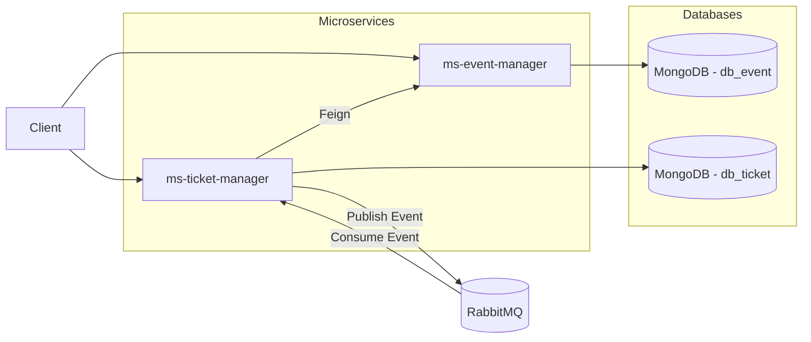

# 🎟️ Arquitetura de Microsserviços com Spring Boot

## 🛠️ Tecnologias


## 📌 Visão Geral
Projeto demonstrando uma arquitetura de microsserviços utilizando **Spring Boot**, mensageria com **RabbitMQ**, persistência com **MongoDB** e orquestração com **Docker** + **Docker Compose**.

A solução é composta por dois microsserviços independentes, cada um com seu banco de dados isolado, comunicando-se de forma síncrona **(OpenFeign)** e assíncrona **(RabbitMQ)**.

---

## 🏗️ Arquitetura do Sistema


---

### 📦 Microserviços

| Serviço             | Responsabilidade              | Banco de Dados | Integrações | Endpoints |
|--------------------|------------------------------|----------------|-------------|----------|
| ms-event-manager   | Gerenciar eventos            | db_event       | -           | Criar e consultar eventos |
| ms-ticket-manager  | Gerenciar tickets de eventos | db_ticket      | RabbitMQ    | Criar e consultar tickets |

---

### 🗄️ Banco de Dados

| Banco       | Descrição                                      | Microserviço         |
|------------|-----------------------------------------------|----------------------|
| db_event   | Armazena dados dos eventos                    | ms-event-manager     |
| db_ticket  | Armazena dados dos tickets                    | ms-ticket-manager    |

---

### 📡 Mensageria

| Tecnologia | Descrição                                               |
|-----------|--------------------------------------------------------|
| RabbitMQ  | Comunicação assíncrona entre os microserviços           |

---


## 🚀 Como Rodar o Projeto

### Pré-requisitos
- **Docker** instalado e configurado.
- **Docker Compose** instalado.
- **Git** (para clonar o repositório).

### Passos para Execução

1. **Clone o repositório**:
   ```bash
   git clone https://github.com/bruna-crist/Projeto_SpringBoot_com_microsservicos.git
   cd Projeto_SpringBoot_com_microsservicos
   ```

2. **Construa e inicie os containers**:

   ```bash
   docker-compose up --build
   ```

3. **Acesse os microserviços**:

* **ms-event-manager**: [http://localhost:8080](http://localhost:8080)
* **ms-ticket-manager**: [http://localhost:8081](http://localhost:8081)

4. **Acesse o RabbitMQ Management**:

* URL: [http://localhost:15672](http://localhost:15672)
* Usuário: `admin`
* Senha: `admin`

---

## ⚠️ Persistência de Dados

Os bancos MongoDB utilizam volumes Docker.

Isso significa que:
1. Ao rodar o projeto pela primeira vez, os bancos iniciam vazios
2. É necessário criar um evento antes de criar um ticket
3. Se for executado ``` docker compose down -v ```, todos os dados serão apagados
---

## 📝 Requisições de teste

### 1. Criar um Evento

* **URL:** `http://localhost:8080/events/create-event`
* **Método:** `POST`

**Corpo da Requisição (Entrada):**

```json
{
  "eventName": "Show Rock",
  "dateTime": "2025-03-30T21:00:00",
  "cep": "01010-000"
}
```

**Resposta (Saída):**

```json
{
  "id": "ID_DO_EVENTO",
  "eventName": "Show Rock",
  "dateTime": "2025-03-30T21:00:00",
  "cep": "01010-000",
  "logradouro": "Rua São Bento",
  "bairro": "Centro",
  "localidade": "São Paulo",
  "uf": "SP"
}
```
---

### 2. Criar um Ticket

* **URL:** `http://localhost:8081/tickets/create-ticket`
* **Método:** `POST`

**Corpo da Requisição (Entrada):**

```json
{
  "customerName": "Maria",
  "cpf": "12345678",
  "customerMail": "maria@email.com",
  "eventId": "ID_DO_EVENTO",
  "eventName": "Show Rock",
  "brlamount": "R$ 50,00",
  "usdamount": "$ 10,00"
}
```

**Resposta (Saída):**

```json
{
  "ticketId": "ID_DO_TICKET",
  "cpf": "12345678",
  "customerName": "Maria",
  "customerMail": "maria@email.com",
  "event": {
    "eventId": "ID_DO_EVENTO",
    "eventName": "Show Rock",
    "eventDateTime": "2025-03-30T21:00:00",
    "logradouro": "Rua São Bento",
    "bairro": "Centro",
    "localidade": "São Paulo",
    "uf": "SP"
  },
  "BRLAmount": "R$ 50,00",
  "USDAmount": "$ 10,00",
  "status": "concluído"
}
```

---

### 🧠 Problema Técnico Resolvido

O ```ms-ticket-manager``` tentava acessar o ```ms-event-manager``` utilizando ```localhost```, o que não funciona em ambiente **Docker**, pois cada container possui seu próprio ```localhost```.

A solução foi configurar o Feign para utilizar o hostname do serviço na rede Docker:
```http://ms-event-manager:8080```.

---

#### 👩‍💻 Autora

Bruna Cristina
